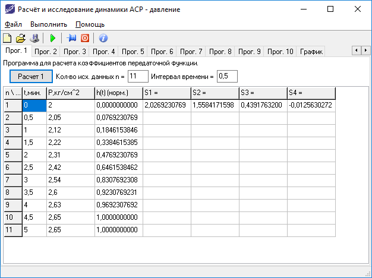
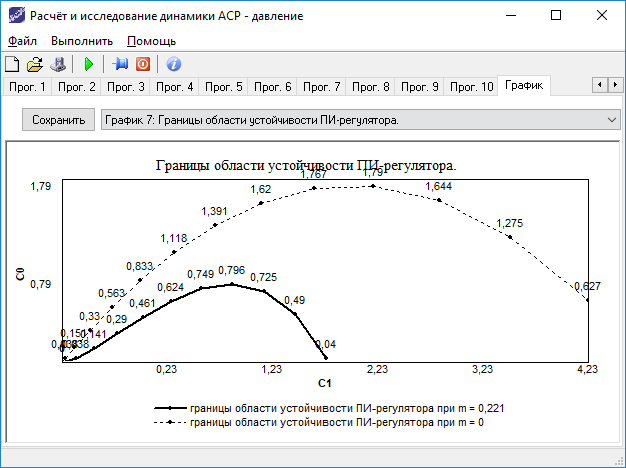

# Automated Control System #


Расчёт и исследование динамики автоматической системы регулирования (АСР)
по дисциплине «Теория автоматического управления» (ТАУ).

Directory structure
-------------------

```bash
├── Screenshots
│   └── ACS_v1alpha # Screenshots for version 1 alpha
├── ACS.dpr # Project file
├── ACS.res # Project's resource file
├── GlobalsUnit.pas # The module of global variables of the program
├── MainUnit.dfm # Form of the main window
├── MainUnit.pas # Module of the main window
├── .gitattributes # Git. Defining attributes per path
├── .gitignore # Git. Specifies intentionally untracked files to ignore
├── LICENSE
└── README.md
```

Technical requirements
----------------------
Testet on IDE "Borland Delphi 7"

Encodong: Cyrillic (Windows 1251)


Screenshots
-----------





Repo owner
----------
> Author: Nazir K. Khusnutdinov
>
> Nazir (c) 2005
>
> Web: [nazir.pro][1]
>
> GitHub: [Nazir][2]

[1]: https://nazir.pro/ACS
[2]: https://github.com/Nazir
